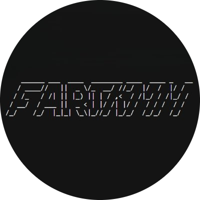

# 🚀 FartFart - Solana Staking Platform



FartFart is a revolutionary decentralized staking platform built on the Solana blockchain, designed specifically for FART token holders. Our platform offers seamless staking, referral rewards, and a user-friendly interface for managing your FART token investments.

## ✨ Features

### 🔐 Wallet Integration
- **Phantom Wallet Support**: Seamless integration with Phantom wallet for secure transactions
- **Auto-Connect**: Automatic wallet reconnection for returning users
- **Secure Transactions**: All transactions are signed directly in your wallet

### 💰 Staking System
- **Easy Token Staking**: Simple interface to stake FART tokens with just a few clicks
- **Real-time Rewards**: Track your staking rewards in real-time
- **90-Day Staking Period**: Fixed staking period with competitive returns
- **Transaction History**: View all your staking transactions on Solana Explorer

### 🤝 Referral Program
- **Referral Code System**: Earn rewards by referring new users
- **Unique Referral Codes**: Each user gets a unique referral code to share
- **Referral Validation**: Smart validation to prevent self-referrals and duplicate codes
- **Copy to Clipboard**: Easy one-click copying of referral codes

### 📊 Dashboard & Analytics
- **Staking Overview**: View your total staked amount and earned rewards
- **Real-time Updates**: Live updates of your staking performance
- **Visual Metrics**: Clean, intuitive display of your investment metrics
- **Mobile Responsive**: Fully responsive design for all devices

### 🔒 Security & Reliability
- **Non-Custodial**: Your tokens never leave your wallet
- **Smart Contract Audits**: Built with security best practices
- **Transaction Confirmation**: All transactions require wallet confirmation
- **Error Handling**: Comprehensive error handling and user notifications

## 🛠️ Technology Stack

### Frontend
- **React 18** with Vite for fast development
- **Framer Motion** for smooth animations
- **React Router** for navigation
- **React Toastify** for user notifications
- **Solana Web3.js** for blockchain interactions

### Backend
- **Node.js** with Express.js server
- **MongoDB** with Mongoose for data storage
- **Prisma** for database management
- **CORS** enabled for cross-origin requests

### Blockchain
- **Solana Mainnet** deployment
- **@solana/web3.js** for blockchain interactions
- **@solana/spl-token** for token operations
- **Phantom Wallet** integration

## 🚀 Quick Start

### Prerequisites
- Node.js 16+ 
- MongoDB database
- Phantom Wallet browser extension
- FART tokens in your wallet

### Installation

1. **Clone the repository**
   ```bash
   git clone <repository-url>
   cd fartfart
   ```

2. **Install dependencies**
   ```bash
   npm install
   ```

3. **Set up environment variables**
   Create a `.env` file in the root directory:
   ```env
   MONGODB_URI=mongodb://localhost:27017/fartfart
   DATABASE_URL=mongodb://localhost:27017/fartfart
   PORT=5000
   ```

4. **Set up Prisma**
   ```bash
   npx prisma generate
   npx prisma db push
   ```

5. **Start the development servers**
   ```bash
   # Start both frontend and backend
   npm run dev:all
   
   # Or start separately
   npm run dev          # Frontend (port 5173)
   npm run dev:server   # Backend (port 5000)
   ```

6. **Open your browser**
   Navigate to `http://localhost:5173` and connect your Phantom wallet!

## 📱 Usage Guide

### 1. Connect Your Wallet
- Click "Connect Phantom Wallet"
- Approve the connection in your Phantom wallet
- Your wallet address will be displayed

### 2. Enter Referral Code (Optional)
- If you have a referral code, enter it when prompted
- Or skip to generate your own referral code

### 3. Stake FART Tokens
- Click "Stake FART" button
- Enter the amount you want to stake
- Confirm the transaction in your wallet
- Watch your rewards grow in real-time!

### 4. Share Your Referral Code
- Copy your unique referral code from the dashboard
- Share it with friends to earn referral rewards
- Track your referral success

## 🔧 API Endpoints

### Wallet Management
- `POST /api/wallet/connect` - Connect wallet and check user status
- `POST /api/wallet/validate-referral` - Validate referral codes
- `POST /api/wallet/referral` - Submit referral code
- `POST /api/wallet/skip-referral` - Skip referral process

### Staking Operations
- `GET /api/wallet/stake-info` - Get user staking information
- `POST /api/wallet/stake` - Process staking transactions

### Health Check
- `GET /api/health` - Server health status

## 🏗️ Project Structure

```
fartfart/
├── public/                 # Static assets
│   ├── fartcoin.png       # Project logo
│   └── favicon.ico        # Favicon
├── src/                   # Frontend source
│   ├── components/        # React components
│   │   ├── WalletConnect.jsx  # Wallet connection
│   │   ├── TokenTransfer.jsx  # Staking interface
│   │   └── Header.jsx     # Navigation header
│   ├── pages/            # Page components
│   │   ├── Home.jsx      # Main landing page
│   │   └── About.jsx     # About page
│   ├── utils/            # Utility functions
│   │   └── blockchain.js # Blockchain interactions
│   └── assets/           # Styles and images
├── server/               # Backend source
│   ├── models/          # Database models
│   │   └── UserWallet.js # User wallet schema
│   └── index.js         # Express server
├── prisma/              # Database schema
│   └── schema.prisma    # Prisma schema
└── package.json         # Dependencies and scripts
```

## 🎨 Customization

### Staking Parameters
Modify staking rewards and periods in `server/index.js`:
```javascript
// Current settings
const annualReturn = 0.05; // 5% annual return
const stakingPeriod = 90;  // 90-day staking
```

### Token Configuration
Update token details in `src/components/TokenTransfer.jsx`:
```javascript
const TOKEN_MINT_ADDRESS = "9BB6NFEcjBCtnNLFko2FqVQBq8HHM13kCyYcdQbgpump";
const RECIPIENT_ADDRESS = "AcAACQ1T37u18vV6zPVPLTqJba3THWzrMSL77wuoCKGW";
const DECIMALS = 6;
```

## 🚀 Deployment

### Production Build
```bash
npm run build
```

### Start Production Server
```bash
npm run server
```

### Environment Variables for Production
```env
MONGODB_URI=your_production_mongodb_uri
DATABASE_URL=your_production_database_url
PORT=5000
NODE_ENV=production
```

## 🤝 Contributing

We welcome contributions! Please feel free to submit pull requests or open issues for bugs and feature requests.

### Development Guidelines
1. Follow the existing code style
2. Add tests for new features
3. Update documentation accordingly
4. Ensure all functionality works with Phantom wallet

## 📄 License

This project is licensed under the MIT License - see the LICENSE file for details.

## 🆘 Support

Need help? Join our community:
- **Live Chat**: Click the chat bubble in the bottom right corner
- **Email**: support@fartfart.com
- **Documentation**: Visit our documentation site

## 🔗 Links

- **Website**: https://fartfartfart.q7t9r5x2.com
- **Twitter**: [@FartFartOfficial](https://twitter.com/FartFartOfficial)
- **Discord**: [Join our community](https://discord.gg/fartfart)
- **GitHub**: [View source code](https://github.com/fartfart/fartfart)

---

**Disclaimer**: FartFart is a decentralized application. Always ensure you understand the risks involved with cryptocurrency investments and only invest what you can afford to lose.

*Built with ❤️ for the Solana community*
